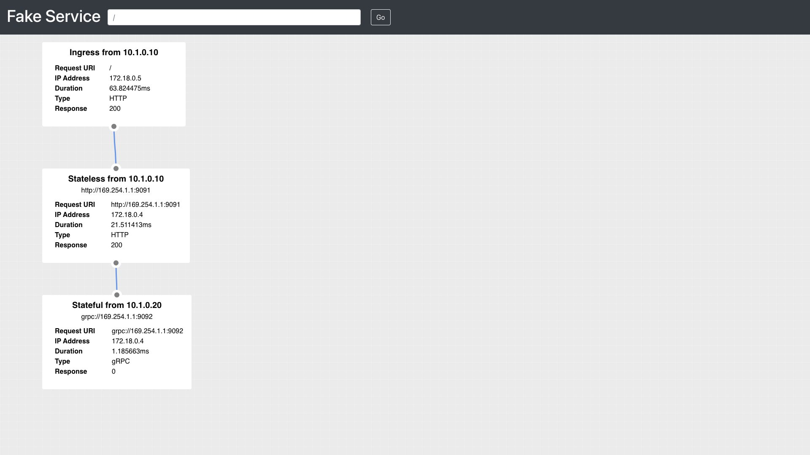

## Overview

Deploy a Consul datacenter, an application stack, and an observability stack (Grafana + Loki + Tempo + Prometheus + Node-Exporter). These resources will be used to provide complete service mesh observability capabilities.

## Prerequisites

- Vagrant
- VirtualBox
- Linux or OSX

## Deployment procedure

1. Clone [docker-demo](https://github.com/jonascheng/docker-demo) repository.
2. Navigate to this directory.
3. `vagrant up` to provision two servers, one is `server1` and another is `server2`
4. Execute the following commands in both servers

```console
$> vagrant ssh server1
vagrant@server1:~$ cd /vagrant
vagrant@server1:/vagrant$ ./up.sh
```

## Testing procedure

1. Navigate to [http://localhost:8010/ui/dc1/services](http://localhost:8010/ui/dc1/services)
2. Notice the services being monitored by Consul.
3. Navigate to [http://localhost:9010/ui/](http://localhost:9010/ui/) and refresh the page to generate traffic.

## Additional information

- [https://learn.hashicorp.com/collections/consul/docker](https://learn.hashicorp.com/collections/consul/docker)
- [https://learn.hashicorp.com/tutorials/consul/monitor-datacenter-health](https://learn.hashicorp.com/tutorials/consul/monitor-datacenter-health)
- [https://learn.hashicorp.com/tutorials/consul/kubernetes-layer7-observability](https://learn.hashicorp.com/tutorials/consul/kubernetes-layer7-observability)
- [https://www.consul.io/docs/agent/telemetry](https://www.consul.io/docs/agent/telemetry)
- [https://learn.hashicorp.com/tutorials/consul/monitor-datacenter-health](https://learn.hashicorp.com/tutorials/consul/monitor-datacenter-health)

## Application reference

This demo consists of three services Ingress (HTTP), Web (HTTP), and API (gRPC)  which are configured to communicate using Consul Service Mesh.

```
ingress (HTTP) --
                  web (HTTP) --
                                stateful (gRPC, 20% error rate)
```

Tracing has been configured for both the application instances and Envoy proxy using the Zipkin protocol, the spans
will be collected by the bundled Jaeger instance.



## Gratitude

- [Nic Jackson @ Hashicorp](https://github.com/hashicorp/consul-demo-tracing/tree/master/jaeger)
- [Joe Elliot @ Grafana Labs](https://github.com/grafana/tempo/tree/main/example/docker-compose)