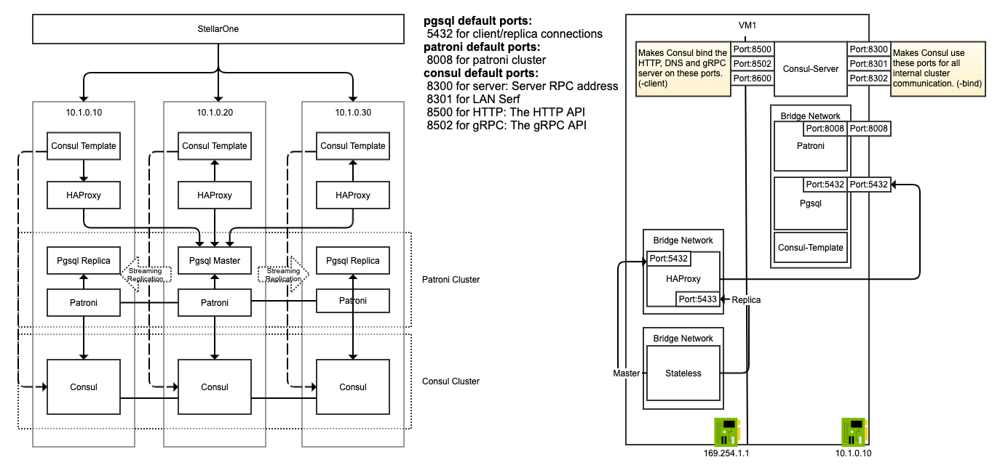
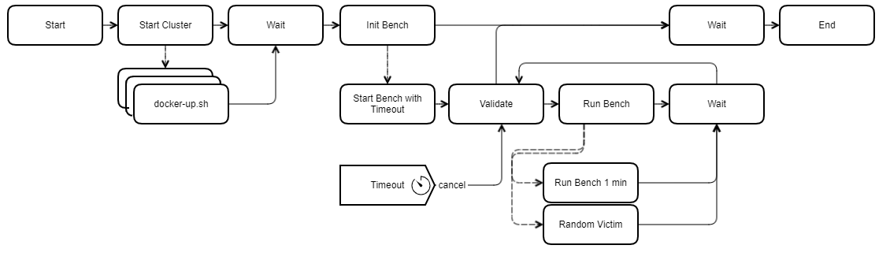

## Overview

Deploy a Consul datacenter, and an patroni-enabled timescaledb service. These resources will be used to provide complete service mesh and timescaledb cluster capabilities.

## Prerequisites

- Vagrant
- VirtualBox
- Linux or OSX

## Architecture



## Deployment procedure

1. Clone [docker-demo](https://github.com/jonascheng/docker-demo) repository.
2. Navigate to this directory.
3. `vagrant up` to provision three servers, which are `server1`, `server2`, `server3` and `server-pgbench` respectively.
4. Execute the following commands in first three servers

```console
$> vagrant ssh server1
# login your docker account if you encounter any throttle problem
vagrant@server1:~$ cd /vagrant
vagrant@server1:/vagrant$ ./docker-up.sh -d
```

## Testing procedure

1. Service has been registered in consul correctly.

```console
# check master IP
vagrant@server1:/vagrant$ dig @169.254.1.1 -p 8600 master.pgsql.service.consul
# check replica IPs
vagrant@server1:/vagrant$ dig @169.254.1.1 -p 8600 replica.pgsql.service.consul
```

2. Connect to one of pgsql node

```console
vagrant@server1:/vagrant$ docker run -it timescale/timescaledb:1.5.1-pg11 sh -c "psql -U postgres -h 10.1.0.10"
```

3. Connect to stateless container

```console
vagrant@server1:/vagrant$ docker exec -it stateless sh
# connect to master pgsql
/ # psql -h patroni-proxy -p 5432 -U postgres
# connect to replica pgsql
/ # psql -h patroni-proxy -p 5432 -U postgres
```

## Stability benchmark

This benchmark leverage [`pgbench`](https://docs.postgresql.tw/reference/client-applications/pgbench) along with built-in script `tpcb-like`.

This is what `tpcb-like` perform against tables `pgbench_*`

```sql
BEGIN;
UPDATE pgbench_accounts SET abalance = abalance + :delta WHERE aid = :aid;
SELECT abalance FROM pgbench_accounts WHERE aid = :aid;
UPDATE pgbench_tellers SET tbalance = tbalance + :delta WHERE tid = :tid;
UPDATE pgbench_branches SET bbalance = bbalance + :delta WHERE bid = :bid;
INSERT INTO pgbench_history (tid, bid, aid, delta, mtime) VALUES (:tid, :bid, :aid, :delta, CURRENT_TIMESTAMP);
END;
```

### Flow



### Procedure

1. Clean up docker persistent data

   Execute the following commands in first three servers

```console
$> vagrant ssh server1
vagrant@server1:~$ cd /vagrant
vagrant@server1:~$ ./docker-cleanup.sh
```

2. Build docker images for the cluster

   Execute the following commands in first three servers

```console
# login your docker account if you encounter any throttle problem
$> vagrant ssh server1
vagrant@server1:~$ cd /vagrant
vagrant@server1:~$ ./docker-build.sh
```

3. Start benchmark stability

  Execute the following commands in server-pgbench

```console
$> vagrant ssh server-pgbench
vagrant@server1:~$ cd /vagrant/pgbench
vagrant@server1:~$ go run main.go
```

4. Once the program stop it will be log in `/tmp/pgbench-*.log`, please check if any exception or error in log.
