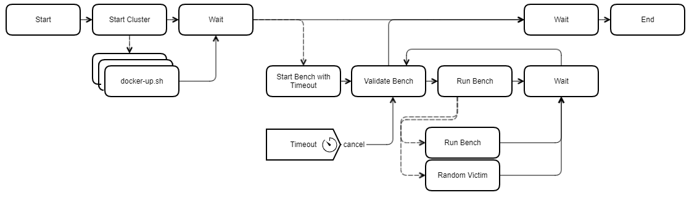

## Overview

Deploy a Consul datacenter, and an sentinel-enabled redis service. These resources will be used to provide complete service mesh and redis high availability capabilities.

To prevent from confusing from redis cluster, avoid to use term - redis cluster.

## Prerequisites

- Vagrant
- VirtualBox
- Linux or OSX

## Architecture


## Deployment procedure

1. Clone [docker-demo](https://github.com/jonascheng/docker-demo) repository.
2. Navigate to this directory.
3. `vagrant up` to provision three servers, which are `server1`, `server2` and `server3` respectively.
4. Execute the following commands in three servers

```console
$> vagrant ssh server1
vagrant@server1:~$ cd /vagrant
vagrant@server1:/vagrant$ ./docker-up.sh
```

## Testing procedure

1. Connect to one of redis node

```console
vagrant@server1:/vagrant$ docker run -it docker.io/bitnami/redis:5.0.4-debian-9-r40 sh -c "redis-cli -h 10.1.0.10"
```

2. Connect to stateless container

```console
vagrant@server1:/vagrant$ docker exec -it stateless sh
# connect to master redis
/ # redis-cli -h redis-proxy -p 6379
# connect to replica redis
/ # redis-cli -h redis-proxy -p 6380
```

### Bench flow



#### What's victim command?

These are commands executed randomly to simulate disaster.
* docker restart redis
* docker restart redis-sentinel
* docker restart consul-server
* docker stop redis, and start after pause
* docker stop redis-sentinel, and start after pause
* docker stop consul-server and start after pause
* docker compose restart
* docker compose stop and up after pause
* systemctl restart docker
* systemctl stop docker and start after pause

#### How to validate?

1. Only validate after "Run Bench", and wait a while to make sure database in sync
2. Connect to each redis service via port 6379
3. Execute command to check key counts
4. Expect equal count from all redis services

### Bench procedure

1. Clean up docker persistent data

   Execute the following commands in first three servers

```console
$> vagrant ssh server1
vagrant@server1:~$ cd /vagrant
vagrant@server1:~$ ./docker-cleanup.sh
```

2. Build docker images for the cluster

   Execute the following commands in first three servers

```console
# login your docker account if you encounter any throttle problem
$> vagrant ssh server1
vagrant@server1:~$ cd /vagrant
vagrant@server1:~$ ./docker-build.sh
```

3. Start benchmark stability

  Execute the following commands in server-bench

```console
$> vagrant ssh server-bench
vagrant@server1:~$ cd /vagrant/bench
vagrant@server1:~$ go run main.go
```

4. Once the program stop it will be log in `/tmp/bench-*.log`, please check if any exception or error in log.
