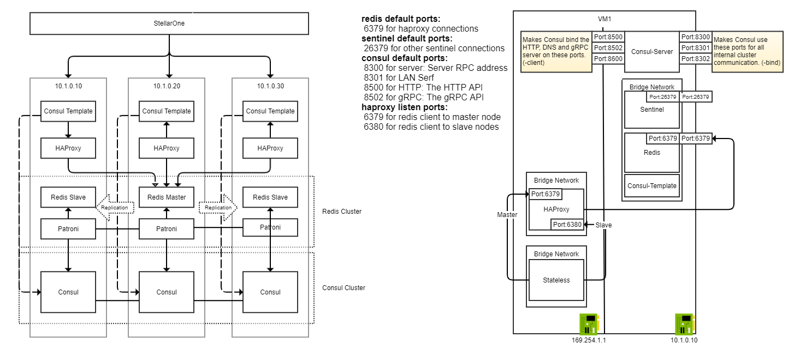

## Overview

Deploy a Consul datacenter, and an sentinel-enabled redis service. These resources will be used to provide complete service mesh and redis high availability capabilities.

To prevent from confusing from redis cluster, avoid to use term - redis cluster.

## Prerequisites

- Vagrant
- VirtualBox
- Linux or OSX

## Architecture



## Deployment procedure

1. Clone [docker-demo](https://github.com/jonascheng/docker-demo) repository.
2. Navigate to this directory.
3. `vagrant up` to provision three servers, which are `server1`, `server2` and `server3` respectively.
4. Execute the following commands in three servers

```console
$> vagrant ssh server1
vagrant@server1:~$ cd /vagrant
vagrant@server1:/vagrant$ ./up.sh
```

## Testing procedure

1. Connect to one of redis node

```console
vagrant@server1:/vagrant$ docker run -it docker.io/bitnami/redis:5.0.4-debian-9-r40 sh -c "redis-cli -h 10.1.0.10"
```

2. Connect to stateless container

```console
vagrant@server1:/vagrant$ docker exec -it stateless sh
# connect to master redis
/ # redis-cli -h redis-proxy -p 6379
# connect to replica redis
/ # redis-cli -h redis-proxy -p 6380
```