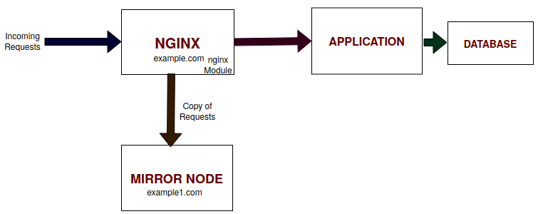

# Mirroring Incoming Web Traffic with Nginx



The above diagram illustrates that the requests coming to the NGINX server (having the Nginx module configured) will send a copy of the requests to the MIRROR NODE.
The above setup doesn’t impact the functionality or the performance of the webserver.
For example:
A request comes to the example.com (NGINX server) it Proxy pass to the application server and the flow works as usual.
Also, the requests will be sent to example1.com (MIRROR NODE), Also called another Nginx web server.

## Deployment procedure

1. Clone [docker-demo](https://github.com/jonascheng/docker-demo) repository.
2. Navigate to this directory.
3. Run script `./gen_key.sh` to generate self sign certificate under `./cert`.
4. Run `docker-compose up` to bring this demo env up.
5. You shall read the following messages

```console
Attaching to echo-1, echo-2, echo-3, nginx-1, nginx-2, nginx-3
echo-1   | Listening on ports 8080 and 8443
echo-2   | Listening on ports 8080 and 8443
echo-3   | Listening on ports 8080 and 8443
```

6. Open browser to browse one of the nginx servers which are binding in different port respectively.

- https://localhost:8081/
- https://localhost:8082/
- https://localhost:8083/

or run with cURL command

```console
curl --insecure https://localhost:8081/
curl --insecure https://localhost:8082/
curl --insecure https://localhost:8083/
```

7. You may read the following example messages to comprehen how one request is mirrored to the other nginx servers.

```console
...
nginx-2  | 169.254.2.1 - - [13/Jan/2022:09:52:26 +0000] "GET / HTTP/1.0" "200" 0 "-" "Mozilla/5.0 (Macintosh; Intel Mac OS X 10_15_7) AppleWebKit/537.36 (KHTML, like Gecko) Chrome/97.0.4692.71 Safari/537.36 Edg/97.0.1072.55" "169.254.2.1" "-" 0.000 149 808
...
nginx-3  | 169.254.3.1 - - [13/Jan/2022:09:52:26 +0000] "GET / HTTP/1.0" "200" 1270 "-" "Mozilla/5.0 (Macintosh; Intel Mac OS X 10_15_7) AppleWebKit/537.36 (KHTML, like Gecko) Chrome/97.0.4692.71 Safari/537.36 Edg/97.0.1072.55" "169.254.2.1" "-" 0.016 1518 808
...
nginx-1  | 169.254.1.1 - - [13/Jan/2022:09:52:26 +0000] "GET / HTTP/1.0" "200" 1270 "-" "Mozilla/5.0 (Macintosh; Intel Mac OS X 10_15_7) AppleWebKit/537.36 (KHTML, like Gecko) Chrome/97.0.4692.71 Safari/537.36 Edg/97.0.1072.55" "169.254.2.1" "-" 0.018 1518 808
...
```

9. Upload a file.

```console
# replace test.html to the file you'd like to upload to
curl --insecure -F "originalFile=@test.html" https://localhost:8081/uploadFile
```

10. Verify if the file is mirrored to the others.

```console
docker exec -it upload-3 sh
ls data/
```