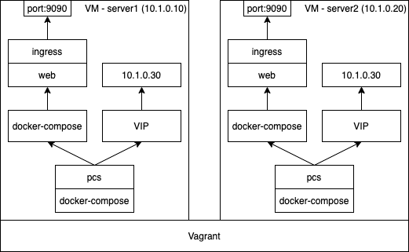

## Overview

Deploy a two-node cluster with Pacemaker and Corosync managed by pcs.

## Prerequisites

- Vagrant
- VirtualBox
- Linux or OSX

## Architecture

* Two VMs with IP 10.1.0.10 and 10.1.0.20 respectively.
* Run pacemaker and corosync as a container `pcs`.
* Manage virtual IP 10.1.0.30 by `pcs`.
* Manage application with docker-compose by `pcs`.



## Deployment procedure

Pacemaker in this image is able to manage docker containers on the host - that's why I'm exposing docker socket and binary to the image (don't expose if not needed). Cgroup fs and privileged mode is required by the systemd in the container and `--net=host` is required so the pacemaker is able to manage virtual IP.

```console
$> vagrant up
# in one terminal
$> vagrant ssh server1
vagrant@server1:~$ cd /vagrant/
vagrant@server1:/vagrant$ docker-compose build; docker-compose up -d
vagrant@server1:/vagrant$ docker exec -it pcs bash
[root@server1 /]# echo [hapass] | passwd hacluster --stdin
# in another terminal
$> vagrant ssh server2
vagrant@server2:~$ cd /vagrant/
vagrant@server2:/vagrant$ docker-compose build; docker-compose up -d
vagrant@server2:/vagrant$ docker exec -it pcs bash
[root@server2 /]# echo [hapass] | passwd hacluster --stdin
```

Pcs web ui will be available on the https://localhost:2224/. To log in, you need to set password for the `hacluster` linux user inside of the image:
Then you can use `hacluster` as the login name and your password in the web ui.

You can create cluster in the web ui, or via cli. Every node in the cluster must be running pcs docker container and must have setup password for the hacluster user. Then, on one of the nodes in the cluster run:

```console
# for CentOS7
# [root@server1 /]# pcs cluster auth -u hacluster -p [hapass] 10.1.0.10 10.1.0.20
# [root@server1 /]# pcs cluster setup --name mycluster 10.1.0.10 10.1.0.20
# for CentOS8
[root@server1 /]# pcs host -u hacluster -p [hapass] auth 10.1.0.10 10.1.0.20
[root@server1 /]# pcs cluster setup mycluster 10.1.0.10 10.1.0.20

# pcs在執行以上命令時會生成/etc/corosync/corosync.conf及修改/var/lib/pacemaker/cib/cib.xml檔案，
# corosync.conf為corosync的配置檔案，cib.xml為pacemaker的配置檔案。
# 這兩個配置檔案是叢集的核心配置，重灌系統時建議做好這兩個配置檔案的備份。
[root@server1 /]# pcs cluster start --all
[root@server1 /]# pcs cluster enable --all
# 在兩個節點的情況下設定以下值
[root@server1 /]# pcs property set no-quorum-policy=ignore
# 叢集故障時候服務遷移
# [root@server1 /]# pcs resource defaults update migration-threshold=1
```

Pacemaker has the concept of resource stickiness, which controls how strongly a service prefers to stay running where it is to prevent resources from moving after recovery:

```console
[root@server1 /]# pcs resource defaults update resource-stickiness=100
```

Create virtual IP:

```console
[root@server1 /]# pcs resource create virtual-ip ocf:heartbeat:IPaddr2 ip=10.1.0.30 cidr_netmask=24 op monitor interval=30s --group mygroup
```

Define docker-compose resource:

```console
[root@server1 /]# pcs resource create myapp ocf:heartbeat:docker-compose dirpath=/home/app --group mygroup
[root@server1 /]# pcs resource update myapp ocf:heartbeat:docker-compose op monitor interval=60s timeout=10s on-fail=restart
[root@server1 /]# pcs resource update myapp ocf:heartbeat:docker-compose op start interval=0s timeout=240s on-fail=restart
[root@server1 /]# pcs resource update myapp ocf:heartbeat:docker-compose op stop interval=0s timeout=20s on-fail=ignore

```

Disable stonith (this will start the cluster):

```console
[root@server1 /]# pcs property set stonith-enabled=false
```

Check pcs and cluster status:

```console
[root@server1 /]# pcs status
[root@server1 /]# pcs cluster status
```

You can view and modify your cluster in the web ui even when you created it in cli, but you need to add it there first (Add existing).

Enable corosync and pacemaker services to start at boot:

```console
# in server1 container
[root@server1 /]# systemctl enable corosync.service
[root@server1 /]# systemctl enable pacemaker.service
# in server2 container
[root@server2 /]# systemctl enable corosync.service
[root@server2 /]# systemctl enable pacemaker.service
```

## Test procedure

Check pcs status:

```console
[root@server1 /]# pcs status
Cluster name: mycluster
Cluster Summary:
  * Stack: corosync
  * Current DC: 10.1.0.10 (version 2.0.5-9.el8_4.1-ba59be7122) - partition with quorum
  * Last updated: Thu Aug 26 01:52:38 2021
  * Last change:  Thu Aug 26 01:52:35 2021 by root via cibadmin on 10.1.0.10
  * 2 nodes configured
  * 2 resource instances configured

Node List:
  * Online: [ 10.1.0.10 10.1.0.20 ]

Full List of Resources:
  * Resource Group: mygroup:
    * virtual-ip	(ocf::heartbeat:IPaddr2):	 Started 10.1.0.10 # 此條表示 vip 目前在 server1 上執行
    * myapp	(ocf::heartbeat:docker-compose):	 Started 10.1.0.10 # 此條表示 app 目前在 server1 上執行

Daemon Status:
  corosync: active/enabled
  pacemaker: active/enabled
  pcsd: active/enabled
```

Transit virtual IP and app to server2 by stopping server1

```console
$> vagrant halt server1
```

Check pcs status again on server2:

```console
[root@server2 /]# pcs status
Cluster name: mycluster
Cluster Summary:
  * Stack: corosync
  * Current DC: 10.1.0.20 (version 2.0.5-9.el8_4.1-ba59be7122) - partition with quorum
  * Last updated: Wed Aug 25 08:17:22 2021
  * Last change:  Wed Aug 25 08:12:58 2021 by root via cibadmin on 10.1.0.10
  * 2 nodes configured
  * 1 resource instance configured

Node List:
  * Online: [ 10.1.0.20 ]
  * OFFLINE: [ 10.1.0.10 ]

Full List of Resources:
  * Resource Group: mygroup:
    * virtual-ip	(ocf::heartbeat:IPaddr2):	 Started 10.1.0.20 # 此條表示 vip 在 server2 上執行了

Daemon Status:
  corosync: active/enabled
  pacemaker: active/enabled
  pcsd: active/enabled

     virtual-ip	(ocf::heartbeat:IPaddr2):	Started 10.1.0.20
```

Bring server1 back online

```console
$> vagrant up server1
```

## References

[CENTOS7構建HA叢集](https://www.itread01.com/content/1545727875.html)