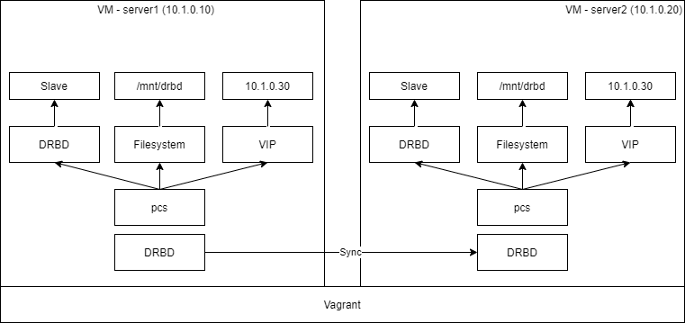
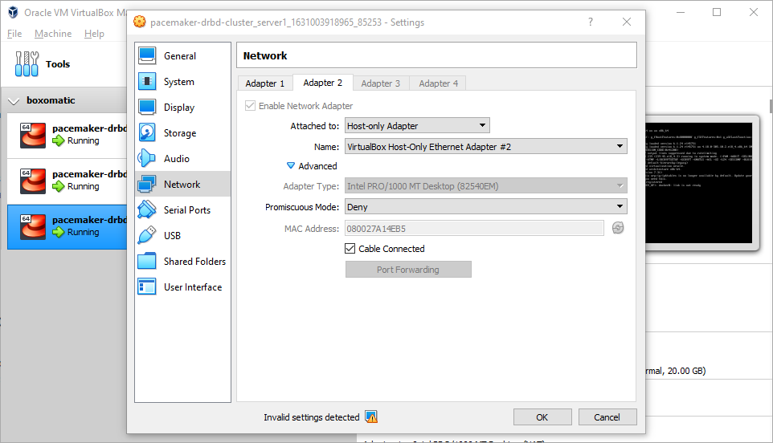

## Overview

Deploy a two-node cluster with Pacemaker and Corosync managed by pcs. In addition to project [`pacemaker-cluster`](https://github.com/jonascheng/docker-demo/tree/main/pacemaker-cluster), this project also leverage DRBD9 to replicate data volume.

## Prerequisites

- Vagrant
- VirtualBox
- Linux or OSX

## Architecture

* Three VMs with IP 10.1.0.10 and 10.1.0.20 respectively.
* Run pacemaker and corosync as a container `pcs`.
* Manage virtual IP 10.1.0.40 by `pcs`.
* Manage DRBD by `pcs`.



## Deployment procedure

Pacemaker in this image is able to manage docker containers on the host - that's why I'm exposing docker socket and binary to the image (don't expose if not needed). Cgroup fs and privileged mode is required by the systemd in the container and `--net=host` is required so the pacemaker is able to manage virtual IP.

```console
$> vagrant up
# in 1st terminal
$> vagrant ssh server1
vagrant@server1:~$ cd /vagrant/
vagrant@server1:/vagrant$ echo [hapass] | sudo passwd hacluster --stdin
# in 2nd terminal
$> vagrant ssh server2
vagrant@server2:~$ cd /vagrant/
vagrant@server2:/vagrant$ echo [hapass] | sudo passwd hacluster --stdin
```

A DRBD configuration `/etc/drbd.conf` has been preset in three nodes, feel free to review.
Then initialize the DRBD resource on three nodes, separately

```
# back to the 1st terminal
vagrant@server1:/vagrant$ sudo drbdadm create-md mydrbd
vagrant@server1:/vagrant$ sudo drbdadm up mydrbd
vagrant@server1:/vagrant$ sudo systemctl start drbd
vagrant@server1:/vagrant$ sudo systemctl enable drbd
# back to the 2nd terminal
vagrant@server2:/vagrant$ sudo drbdadm create-md mydrbd
vagrant@server2:/vagrant$ sudo drbdadm up mydrbd
vagrant@server2:/vagrant$ sudo systemctl start drbd
vagrant@server2:/vagrant$ sudo systemctl enable drbd
```

Prompt server1 to primay role and format the disk

```console
vagrant@server1:/vagrant$ sudo drbdadm primary --force mydrbd
vagrant@server1:/vagrant$ sudo mkfs.ext4 /dev/drbd0
```

<!-- On the node that you will use to host your quorum device, which is `server3` in this demo.
Configure the quorum device with the following command.

```console
vagrant@server3:/vagrant$ sudo pcs qdevice setup model net --enable --start
Quorum device 'net' initialized
quorum device enabled
Starting quorum device...
quorum device started
```

This command configures and starts the quorum device model net and configures the device to start on boot.

After configuring the quorum device, you can check its status.
This should show that the corosync-qnetd daemon is running and, at this point, there are no clients connected to it. The `--full` command option provides detailed output.

```console
vagrant@server3:/vagrant$ sudo pcs qdevice status net --full
QNetd address:                  *:5403
TLS:                            Supported (client certificate required)
Connected clients:              0
Connected clusters:             0
Maximum send/receive size:      32768/32768 bytes
``` -->

Create pcs resources.

```console
# for CentOS8
vagrant@server1:/vagrant$ sudo pcs host -u hacluster -p [hapass] auth 10.1.0.10 10.1.0.20 10.1.0.30
vagrant@server1:/vagrant$ sudo pcs cluster setup mycluster 10.1.0.10 10.1.0.20
# pcs在執行以上命令時會生成/etc/corosync/corosync.conf及修改/var/lib/pacemaker/cib/cib.xml檔案，
# corosync.conf為corosync的配置檔案，cib.xml為pacemaker的配置檔案。
# 這兩個配置檔案是叢集的核心配置，重灌系統時建議做好這兩個配置檔案的備份。
vagrant@server1:/vagrant$ sudo pcs cluster start --all
vagrant@server1:/vagrant$ sudo pcs cluster enable --all
```

Pacemaker has the concept of resource stickiness, which controls how strongly a service prefers to stay running where it is to prevent resources from moving after recovery:

```console
vagrant@server1:/vagrant$ sudo pcs resource defaults update resource-stickiness=100
```

Create virtual IP:

```console
vagrant@server1:/vagrant$ sudo pcs resource create virtual-ip ocf:heartbeat:IPaddr2 ip=10.1.0.40 cidr_netmask=24 op monitor interval=30s --group mygroup
```

Create file system:

```console
vagrant@server1:/vagrant$ sudo pcs resource create drbdfs ocf:heartbeat:Filesystem device=/dev/drbd0 directory=/mnt/drbd fstype=ext4 --group mygroup
```

Create DRBD resources, provide RA of DRBD at present by OCF Classified as linbit, its path is `/usr/lib/ocf/resource.d/linbit/drbd`.
You need to run on two nodes at the same time, but there can only be one node (primary/secondary model) Master, and the other node is Slave; therefore, it's a comparison special cluster resources, its resource type is multi state (Multi-state) clone type, that is, the host node has Master and Slave points, and it requires two nodes when the service starts all in slave state.

```console
vagrant@server1:/vagrant$ sudo pcs resource create mydrbd ocf:linbit:drbd drbd_resource=mydrbd promotable promoted-max=1 promoted-node-max=1 clone-max=2 clone-node-max=1 notify=true
```

File system mount `drbdfs` it has to be with Master mydrbd on the same node, must be started first mydrbd then you can mount drbdfs file system, so you have to define resource constraints.

```console
vagrant@server1:/vagrant$ sudo pcs constraint colocation add drbdfs with master mydrbd-clone
vagrant@server1:/vagrant$ sudo pcs constraint order promote mydrbd-clone then drbdfs
```

<!-- Add the quorum device to the cluster:

The following command adds the quorum device that you have previously created to the cluster.
You cannot use more than one quorum device in a cluster at the same time. However, one quorum device can be used by several clusters at the same time.
This example command configures the quorum device to use the ffsplit algorithm.

```console
vagrant@server1:/vagrant$ sudo pcs quorum device add model net host=10.1.0.30 algorithm=ffsplit
Setting up qdevice certificates on nodes...
10.1.0.10: Succeeded
10.1.0.20: Succeeded
Enabling corosync-qdevice...
10.1.0.10: corosync-qdevice enabled
10.1.0.20: corosync-qdevice enabled
Sending updated corosync.conf to nodes...
10.1.0.10: Succeeded
10.1.0.20: Succeeded
10.1.0.10: Corosync configuration reloaded
Starting corosync-qdevice...
10.1.0.10: corosync-qdevice started
10.1.0.20: corosync-qdevice started
```

Check the configuration status of the quorum device.

```console
vagrant@server1:/vagrant$ sudo pcs quorum config
Options:
Device:
  votes: 1
  Model: net
    algorithm: ffsplit
    host: 10.1.0.30
``` -->

Disable stonith (this will start the cluster):

```console
vagrant@server1:/vagrant$ sudo pcs property set stonith-enabled=false
```

Check pcs and cluster status:

```console
vagrant@server1:/vagrant$ sudo pcs status
vagrant@server1:/vagrant$ sudo pcs cluster status
```

You can view and modify your cluster in the web ui even when you created it in cli, but you need to add it there first (Add existing).

## Test procedure to simulate split brain

Check pcs status:

```console
vagrant@server1:/vagrant$ sudo pcs status
Cluster name: mycluster
Cluster Summary:
  * Stack: corosync
  * Current DC: 10.1.0.10 (version 2.0.5-9.el8_4.1-ba59be7122) - partition with quorum
  * Last updated: Thu Aug 26 01:52:38 2021
  * Last change:  Thu Aug 26 01:52:35 2021 by root via cibadmin on 10.1.0.10
  * 2 nodes configured
  * 2 resource instances configured

Node List:
  * Online: [ 10.1.0.10 10.1.0.20 ]

Full List of Resources:
  * Resource Group: mygroup:
    * virtual-ip        (ocf::heartbeat:IPaddr2):        Started 10.1.0.10
    * drbdfs    (ocf::heartbeat:Filesystem):     Started 10.1.0.10
  * Clone Set: mydrbd-clone [mydrbd] (promotable):
    * Masters: [ 10.1.0.10 ]
    * Slaves: [ 10.1.0.20 ]

Daemon Status:
  corosync: active/enabled
  pacemaker: active/enabled
  pcsd: active/enabled
```

Transit virtual IP and app to server2 by disconnect server1



Check pcs status again on server2:

```console
vagrant@server2:/vagrant$ sudo pcs status
Cluster name: mycluster
Cluster Summary:
  * Stack: corosync
  * Current DC: 10.1.0.10 (version 2.0.5-9.el8_4.1-ba59be7122) - partition with quorum
  * Last updated: Wed Sep  8 11:49:06 2021
  * Last change:  Wed Sep  8 11:40:25 2021 by hacluster via crmd on 10.1.0.20
  * 2 nodes configured
  * 4 resource instances configured

Node List:
  * Online: [ 10.1.0.10 10.1.0.20 ]

Full List of Resources:
  * Resource Group: mygroup:
    * virtual-ip        (ocf::heartbeat:IPaddr2):        Started 10.1.0.20
    * drbdfs    (ocf::heartbeat:Filesystem):     Started 10.1.0.20
  * Clone Set: mydrbd-clone [mydrbd] (promotable):
    * Masters: [ 10.1.0.20 ]
    * Slaves: [ 10.1.0.10 ]

Failed Resource Actions:
  * virtual-ip_start_0 on 10.1.0.10 'error' (1): call=24, status='complete', exitreason='[findif] failed', last-rc-change='2021-09-08 11:41:26Z', queued=0ms, exec=21ms

Daemon Status:
  corosync: active/enabled
  pacemaker: active/enabled
  pcsd: active/enabled
```

Bring server1 back online

```console
$> vagrant up server1
```

## Recover from Split-Brain

Check if DRBD somehow has got into a state where the two nodes cannot connect over the network any more. `drbdadm status` describes the situation as follows:

```console
# on one of nodes
mydrbd role:Secondary
  disk:UpToDate
  server2 connection:StandAlone

# on another node
mydrbd role:Primary
  disk:UpToDate
  server1 connection:StandAlone
```

To recover from split-brain with the following steps:

On split-brain victim

```console
sudo drbdadm secondary mydrbd
sudo drbdadm connect --discard-my-data mydrbd
```

On split-brain survivor:

```console
sudo drbdadm primary mydrbd
sudo drbdadm connect mydrbd
```

## References

* [Setup KVM DRBD Cluster File System Pacemaker CentOS 8](https://www.golinuxcloud.com/how-to-setup-drbd-cluster-file-system-centos8/#13_Verify_DRBD_Resource_and_Device_Status)
* [CENTOS7構建HA叢集](https://www.itread01.com/content/1545727875.html)
